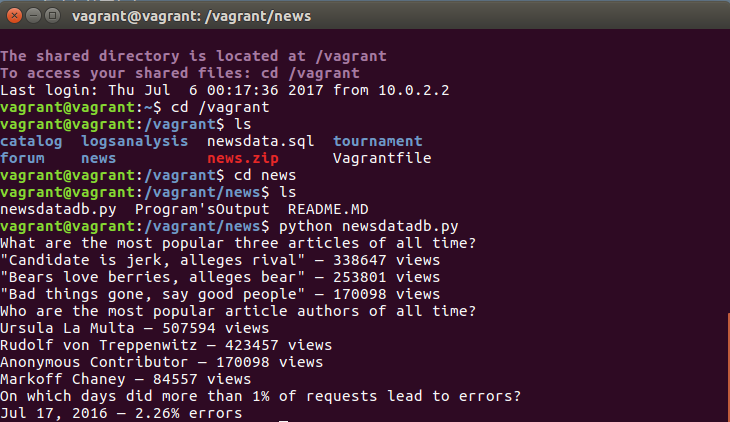

# Project: Logs Analysis 

For this project I designed a reporting tool that prints out reports based on questions given by Udacity. The Database has over 100,000 records which need to be filtered and cleaned in order to print out the correct answer. 

*Question 1* wants you to find the most popular three articles of all time. To solve this problem, I had to use a join, replace, where, and group by commands.

*Question 2* wants you to find the most popular three authors of all time. I solved this problem by using two joins, where, and a group by command. 

*Question 3* wants you to find the day which led to more than 1% of request errors. I was able to solve this answer by using arthimetic operations, which allowed me to discover the days that led to more than 1% of errors.

**Install Prerequisites**

1. Python 2.7
2. Linux-Based virtual machine(VM)
3. Vagrant

**Running Code**

In order to run the code you have to open up the directory where the Vagrantfile is in your command prompt. Within the command prompt type in `vagrant up` then type in `vagrant ssh`. If vagrant up is already running, just type in vagrant ssh. Then change the directory by typing in `cd /vagrant`. Type `ls` to reveal which folders are in the directory. Then change directory to the folder _news_ by typing in `cd news`. Finally, type in `python newsdatadb.py`, which will run the code.

**Views Used**

I used two views to complete the third question. 

1. create view sum_status as select date(time) as date, cast(count(*) as decimal) as total from log group by date;

2. create view sum_404 as select date(time) as date, cast(count(*) as decimal) as NOT_FOUND from log where status = '404 NOT FOUND' group by date order by date asc; 

